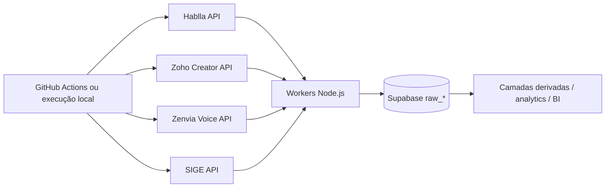
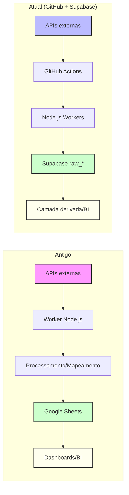
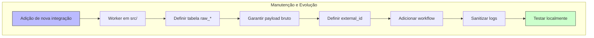
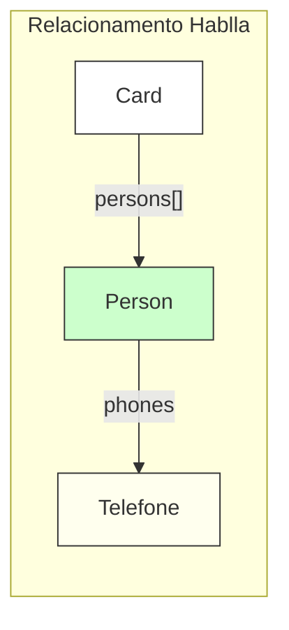

# ICAIU Data

[](https://nodejs.org/)
[](https://github.com/operacoesicaiu/icaiu-data/actions)
[](https://supabase.com/)
[](https://github.com/operacoesicaiu/icaiu-data/actions/workflows/hablla-cards.yml)
[](https://github.com/operacoesicaiu/icaiu-data/actions/workflows/zoho-scheduling.yml)
[](https://github.com/operacoesicaiu/icaiu-data/actions/workflows/zenvia-calls.yml)

Coletor de dados brutos de integrações externas para o Supabase.

O projeto roda chamadas para APIs de terceiros, transforma apenas o envelope de armazenamento e grava o retorno bruto em tabelas `raw_*` no Supabase.

## Objetivo

Este repositório existe para resolver um problema específico:

- buscar dados em APIs externas de forma programada
- persistir esses dados em uma camada raw confiável
- desacoplar a coleta da camada analítica ou operacional
- manter histórico reprocessável sem depender de servidores sempre ligados

Em outras palavras, este projeto e a etapa de ingestão. Modelagem, joins, enriquecimento, dashboards e regras derivadas devem acontecer depois, fora da camada raw.

## Princípios da arquitetura

1. O `payload` salvo no banco deve continuar bruto.
2. O que pode variar e o envelope de ingestão: `external_id`, tabela de destino, janelas de coleta, logs e agendamento.
3. A tabela raw e um espelho operacional da API, não uma camada de negócio.
4. Dados públicos de execução podem aparecer em logs, mas segredos e respostas completas de erro não.

## Visão geral



## Estrutura do projeto

```text
.
├── .github/workflows/     # execuções agendadas e manuais no GitHub Actions

├── src/
│   ├── hablla/           # integrações Hablla
│   ├── zoho/             # integrações Zoho
│   ├── zenvia/           # integração Zenvia
│   ├── sige/             # integração SIGE
│   └── lib/              # utilitários compartilhados
├── run-local.js          # runner local simples
└── .env.example          # referência das variáveis de ambiente
```

## Por que GitHub Actions chamando a API e depois enviando ao Supabase

Para este caso, GitHub Actions + Supabase é uma escolha melhor do que manter um servidor próprio ou um worker 24/7.

### Benefícios práticos

- custo operacional baixo para um pipeline de ingestão leve
- sem necessidade de manter VM, container ou servidor permanente
- credenciais centralizadas em GitHub Secrets
- execuções reproduzíveis e auditáveis por workflow
- fácil reprocessamento manual via `workflow_dispatch`
- Supabase funciona como armazenamento confiável e simples para a camada raw

### Por que não gravar direto em uma camada modelada

- a API pode mudar sem aviso
- modelos de negócio mudam com frequência
- manter o bruto permite reprocessar sem nova coleta externa
- joins e enriquecimentos podem ser refeitos depois com mais segurança

### Limites e comportamento do GitHub Actions

Em repositórios públicos, o uso de runners hospedados padrão do GitHub normalmente é viável sem a pressão de cobrança por minutos que existe em muitos cenários privados, mas ainda existem limitações operacionais relevantes:

- cada job em runner hospedado pelo GitHub tem limite de até 6 horas
- workflows agendados por `cron` podem atrasar alguns minutos
- a granularidade mínima do `schedule` e de 5 minutos
- execuções simultâneas demais aumentam risco de fila, sobreposição e rate limit nas APIs externas

Por isso a estratégia adotada aqui é:

- rodar cargas pequenas com mais frequência
- rodar cargas maiores poucas vezes por dia
- escalonar horários para evitar concorrência desnecessária

## Integrações atuais

### Hablla Clients

- Arquivo: `src/hablla/hablla-clients.js`
- Fonte: endpoint de `persons`
- Destino: `raw_contact_hablla`
- Janela: últimos 5 dias, incluindo hoje
- Identificador externo: `client-{id}`
- Objetivo: persistir os contatos/clientes brutos da Hablla

### Hablla Cards

- Arquivo: `src/hablla/hablla-cards.js`
- Fonte: endpoint de `cards`
- Destino: `raw_events_hablla`
- Janela: ultimos 7 dias por padrao (`HABLLA_CARDS_DAYS`)
- Identificador externo: `card-{id}`
- Objetivo: persistir os cards brutos do board configurado

### Hablla Attendants

- Arquivo: `src/hablla/hablla-attendants.js`
- Fonte: relatório `services/summary`
- Destino: `raw_cs_avaliacao_atendimento`
- Janela: últimos 5 dias
- Estratégia de coleta: chamada diária, um dia por vez
- Identificador externo: `attendant-{YYYY-MM-DD}-{id}`
- Objetivo: evitar agregação indevida por período na API de summary

### Zenvia Calls

- Arquivo: `src/zenvia/zenvia-calls.js`
- Fonte: relatório de chamadas ou fila
- Destino: `raw_contact_telefonia`
- Janela: últimos 5 dias
- Identificador externo: `id` da chamada
- Observação: operacionalmente a fonte costuma fazer mais sentido em execução diária, porque o dado útil geralmente fecha no dia anterior

### SIGE Faturamento

- Arquivo: `src/sige/sige-faturamento.js`
- Fonte: pedidos com status `Pedido Faturado`
- Destino: `raw_events_faturado`
- Janela: últimos 5 dias
- Estratégia de coleta: dia a dia
- Identificador externo: `pedido-{Codigo}`

### Zoho Leads Full

- Arquivo: `src/zoho/zoho-leads.js`
- Helper: `src/zoho/zoho-leads-sync.js`
- Destino: `raw_contact_site`
- Janela: últimos 15 dias
- Estratégia: dia a dia para evitar paginação excessiva e facilitar reprocessamento
- Identificador externo: `lead-{ID}`

### Zoho Leads Recent

- Arquivo: `src/zoho/zoho-leads-recent.js`
- Helper: `src/zoho/zoho-leads-sync.js`
- Destino: `raw_contact_site`
- Janela: últimos 7 dias
- Objetivo: atualização mais frequente da janela recente

### Zoho Scheduling Full

- Arquivo: `src/zoho/zoho-scheduling.js`
- Helper: `src/zoho/zoho-scheduling-sync.js`
- Destino: `raw_events_agendamento`
- Janela: mês atual + mês anterior
- Identificador externo: `agendamento-{ID}`

### Zoho Scheduling Recent

- Arquivo: `src/zoho/zoho-scheduling-recent.js`
- Helper: `src/zoho/zoho-scheduling-sync.js`
- Destino: `raw_events_agendamento`
- Janela: últimos 7 dias
- Objetivo: atualização frequente sem rerodar a carga maior o tempo todo

## Relacionamento importante na Hablla

Existe um vínculo útil entre cards e contatos:

- `payload.persons` no card contém ids de `persons`
- cada id pode ser resolvido em `/persons/{id}`
- os telefones do contato ficam em `phones`

Esse relacionamento é útil para camada derivada, mas não deve ser usado para alterar o `payload` raw salvo nas tabelas raw da Hablla.

Detalhes adicionais estão em `src/hablla/README.md`.

## Agendamentos atuais

Todos os workflows também aceitam execução manual via `workflow_dispatch`.

### Horários em UTC

| Workflow | Arquivo | Cron UTC | Frequência | Script |
|---|---|---|---|---|
| Hablla Attendants | `.github/workflows/hablla-attendants.yml` | `17 6 * * *` | 1x por dia | `node src/hablla/hablla-attendants.js` |
| Hablla Clients | `.github/workflows/hablla-clients.yml` | `5 3,9,15,21 * * *` | 4x por dia | `node src/hablla/hablla-clients.js` |
| Hablla Cards | `.github/workflows/hablla-cards.yml` | `10 3,9,15,21 * * *` | 4x por dia | `node src/hablla/hablla-cards.js` |
| Zenvia Calls | `.github/workflows/zenvia-calls.yml` | `17 4 * * *` | 1x por dia | `node src/zenvia/zenvia-calls.js` |
| SIGE Faturamento | `.github/workflows/sige-faturamento.yml` | `47 4 * * *` | 1x por dia | `node src/sige/sige-faturamento.js` |
| Zoho Scheduling Full | `.github/workflows/zoho-scheduling.yml` | `0 15 * * *` | 1x por dia | `node src/zoho/zoho-scheduling.js` |
| Zoho Leads Full | `.github/workflows/zoho-leads.yml` | `30 15 * * *` | 1x por dia | `node src/zoho/zoho-leads.js` |
| Zoho Scheduling Recent | `.github/workflows/zoho-scheduling-recent.yml` | `10 1,7,13,19 * * *` | 4x por dia | `node src/zoho/zoho-scheduling-recent.js` |
| Zoho Leads Recent | `.github/workflows/zoho-leads-recent.yml` | `40 1,7,13,19 * * *` | 4x por dia | `node src/zoho/zoho-leads-recent.js` |

### Leitura rápida em horário de Brasília

Considerando UTC-3:

- Hablla Clients: 00:05, 06:05, 12:05, 18:05
- Hablla Cards: 00:10, 06:10, 12:10, 18:10
- Zenvia: 01:17
- SIGE: 01:47
- Hablla Attendants: 03:17
- Zoho Scheduling Full: 12:00
- Zoho Leads Full: 12:30
- Zoho Scheduling Recent: 22:10, 04:10, 10:10, 16:10
- Zoho Leads Recent: 22:40, 04:40, 10:40, 16:40

## Segurança e logs

Como o repositório e os workflows podem ter execução pública, os scripts ativos foram ajustados para evitar dumping de respostas completas de erro.

Hoje os logs de erro são sanitizados e mostram apenas dados operacionais como:

- status HTTP
- código de erro
- mensagem resumida

O projeto não deve fazer log de:

- tokens
- segredos
- payload bruto completo
- resposta completa de erro da API

## Variáveis de ambiente

Use `.env.example` como referência local. Em produção, os mesmos nomes devem existir em GitHub Secrets.

### Comuns

| Variável | Uso |
|---|---|
| `SUPABASE_URL` | URL do projeto Supabase |
| `SUPABASE_SERVICE_ROLE_KEY` | chave server-side para upsert nas tabelas raw |

### Hablla

| Variável | Uso |
|---|---|
| `HABLLA_TOKEN` | token direto da Hablla, quando disponível |
| `HABLLA_EMAIL` | fallback de login |
| `HABLLA_PASSWORD` | fallback de login |
| `HABLLA_WORKSPACE_ID` | workspace da Hablla |
| `HABLLA_BOARD_ID` | board consultado por cards |
| `HABLLA_CARDS_DAYS` | quantidade de dias da janela de cards; padrao 7 |
| `HABLLA_CARDS_MAX_PAGES` | limite defensivo de paginas em cards; padrao 500 |
| `HABLLA_ATTENDANTS_DAYS` | quantidade de dias no sync diário de attendants |

### Zenvia

| Variável | Uso |
|---|---|
| `ZENVIA_ACCESS_TOKEN` | token de acesso da API |
| `ZENVIA_REQUEST_DELAY_MS` | pausa em milissegundos entre chamadas para a API da Zenvia; padrao 1000 |

As filas sao buscadas automaticamente pela API da Zenvia antes da sincronizacao.

### SIGE

| Variável | Uso |
|---|---|
| `SIGE_TOKEN` | token da API |
| `SIGE_USER` | usuário exigido pela API |
| `SIGE_APP` | identificação da aplicação |

### Zoho

| Variável | Uso |
|---|---|
| `ZOHO_CLIENT_ID` | OAuth client id |
| `ZOHO_CLIENT_SECRET` | OAuth client secret |
| `ZOHO_REFRESH_TOKEN` | refresh token |
| `ZOHO_ACCOUNT_OWNER` | owner da conta/app no Zoho Creator |
| `ZOHO_LEADS_APP_NAME` | app usado na integração de leads |
| `ZOHO_LEADS_REPORT_NAME` | report de leads |
| `ZOHO_SCHEDULING_APP_NAME` | app usado na integração de agendamento |
| `ZOHO_SCHEDULING_REPORT_NAME` | report de agendamento |

## Como rodar localmente

### Pré-requisitos

- Node.js 20 ou compatível
- `.env` preenchido

### Instalação

```bash
npm install
```

### Executar tudo

```bash
node run-local.js
```

### Executar uma integração específica

```bash
node run-local.js telefonia
node run-local.js hablla-attendants
node run-local.js hablla-cards
node run-local.js hablla-clients
node run-local.js site
node run-local.js agendamento
node run-local.js faturado
node run-local.js zoho-leads-recent
node run-local.js zoho-scheduling-recent
```

## Como adicionar uma nova integração

1. criar um worker em `src/<origem>/...`
2. definir a tabela raw de destino
3. garantir que o `payload` permaneça bruto
4. definir um `external_id` idempotente
5. adicionar variáveis ao `.env.example`, se necessário
6. adicionar workflow em `.github/workflows`
7. sanitizar logs de erro

## Decisões operacionais importantes

### Por que `external_id` e fundamental

O `external_id` permite reprocessar a mesma janela sem duplicar dados. Isso é o que torna viável buscar 5, 7, 15 dias ou até um mês inteiro repetidamente.

### Por que algumas coletas são diárias e outras mais frequentes

- fontes agregadas por período, como Hablla attendants, exigem cuidado na janela
- fontes mais transacionais, como cards e clients, podem rodar várias vezes ao dia
- Zoho full e mais caro operacionalmente, então roda menos
- Zoho recent cobre atualização curta com custo menor

### Por que não usar um servidor sempre ligado

Para este cenário, isso adicionaria complexidade sem ganho proporcional:

- mais custo fixo
- mais monitoramento
- mais manutenção de infraestrutura
- menos simplicidade para reprocessar manualmente

## Observações


- a pasta `tmp/` e ignorada pelo Git e pode ser usada para amostras locais ou diagnósticos manuais
- `run-local.js` e um atalho operacional, não um orquestrador complexo


## Futuras evoluções possíveis

- adicionar métricas por execução
- persistir checkpoints explícitos por integração
- criar camada derivada SQL ou ETL separada da raw
- padronizar documentação por fonte em cada subpasta de `src/`

## Migração: de Google Sheets para Supabase

## Comparativo com arquitetura antiga


Antes, cada integração (Hablla, Zenvia, Zoho, SIGE) era implementada como um worker separado, com foco em sincronizar dados diretamente para o Google Sheets. O fluxo envolvia:

- Receber tokens temporários via outro worker (Google Auth)
- Buscar dados brutos nas APIs
- Processar, mapear e filtrar campos para compatibilidade com planilhas
- Escrever dados já tratados diretamente no Google Sheets

### Limitações do modelo antigo

- Dependência de múltiplos repositórios/workers
- Processamento e transformação feitos antes do armazenamento
- Dificuldade para versionar, auditar e reprocessar dados brutos
- Risco de perda de informações por normalização precoce
- Planilhas sujeitas a alterações manuais e inconsistências

### Evolução: GitHub Actions + Supabase

O sistema atual aproveita o GitHub Actions para orquestrar a extração bruta dos dados, centralizando a automação, versionamento e logs. O tratamento, modelagem e enriquecimento dos dados são feitos diretamente no Supabase ou em camadas derivadas posteriores, nunca na ingestão.

**Vantagens:**
- Extração bruta e confiável, sem perdas
- Dados brutos preservados para múltiplos usos
- Facilidade de reprocessamento e auditoria
- Redução de complexidade operacional
- Menos dependências entre repositórios

**Resumo visual:**




Antes deste projeto, a coleta de dados era feita por scripts locais ou manuais, gravando diretamente em planilhas Google Sheets. Abaixo, um comparativo visual e os principais benefícios da mudança:

### Comparativo visual

```mermaid
flowchart TD
    subgraph "Antes: Sheets"
        A1[APIs externas] --> B1[Script local/manual]
        B1 --> C1[Google Sheets]
        C1 --> D1[Planilhas compartilhadas]
        D1 --> E1[Dashboards/BI]
    end
    subgraph "Depois: Supabase + GitHub Actions"
        A2[APIs externas] --> B2[GitHub Actions]
        B2 --> C2[Node.js Workers]
        C2 --> D2[Supabase raw_*]
        D2 --> E2[Camada derivada/BI]
    end
    style A1 fill:#f9f,stroke:#333,stroke-width:1px
    style A2 fill:#bbf,stroke:#333,stroke-width:1px
    style C1 fill:#fff,stroke:#333,stroke-width:1px
    style C2 fill:#fff,stroke:#333,stroke-width:1px
    style D1 fill:#cfc,stroke:#333,stroke-width:1px
    style D2 fill:#cfc,stroke:#333,stroke-width:1px
    style E1 fill:#ffe,stroke:#333,stroke-width:1px
    style E2 fill:#ffe,stroke:#333,stroke-width:1px
```



### Benefícios da troca

- **Automação e confiabilidade:** elimina dependência de execução manual/local
- **Execução auditável:** histórico de execuções e logs centralizados no GitHub
- **Reprocessamento fácil:** basta acionar workflow, sem sobrescrever dados
- **Segurança:** segredos e credenciais protegidos por GitHub Secrets
- **Escalabilidade:** fácil adicionar novas integrações e tabelas
- **Menos risco de erro humano:** menos manipulação manual de planilhas
- **Dados brutos preservados:** Supabase armazena o payload original, sem perdas
- **Facilidade de manutenção:** código versionado, documentação centralizada

### Limitações do modelo antigo (Sheets)

- Scripts dependiam de execução manual ou agendamento local
- Planilhas podiam ser alteradas inadvertidamente
- Dificuldade para versionar e auditar mudanças
- Limite de linhas/células e performance em grandes volumes
- Dificuldade para reprocessar períodos antigos

## Visualizações para manutenção futura

### Fluxo de manutenção de integrações



### Grafo de relacionamento Hablla (cards → persons → telefone)



## Orientações para manutenção futura

- Sempre documente novas integrações e tabelas no README e/ou subpastas
- Mantenha o payload bruto nas tabelas raw, sem enriquecimento
- Use external_id idempotente para evitar duplicidade
- Prefira logs operacionais, nunca logue payloads completos ou segredos
- Teste localmente antes de subir workflows
- Atualize variáveis de ambiente e secrets conforme necessário
- Consulte exemplos e diagramas acima para entender o fluxo
