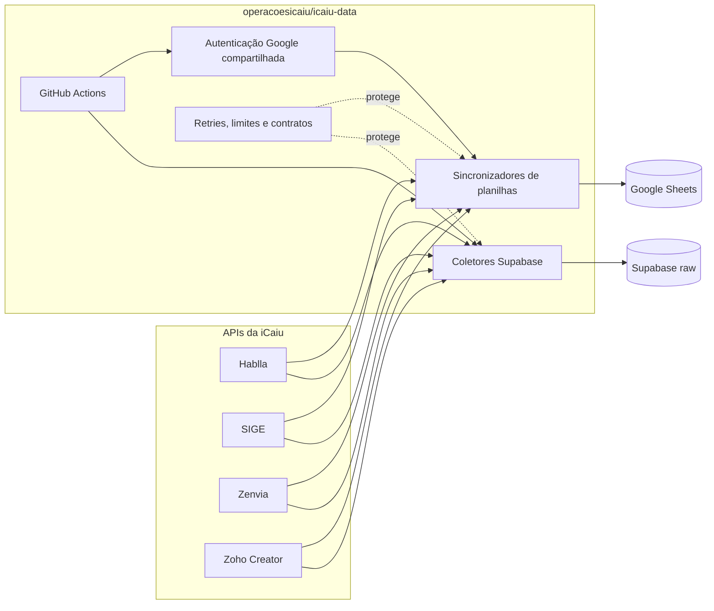
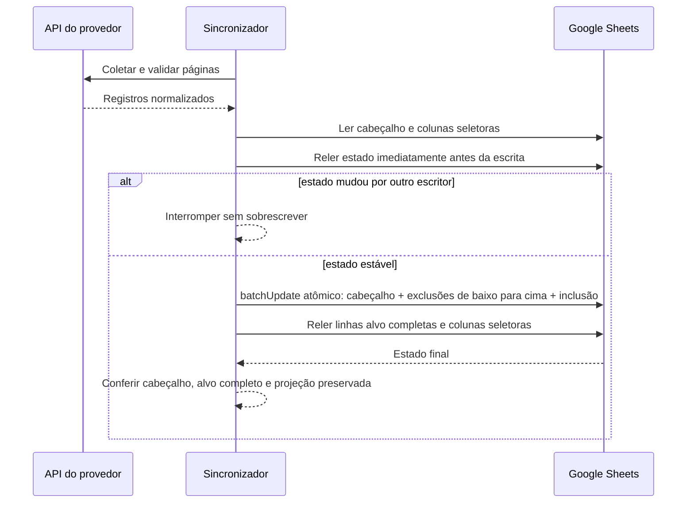
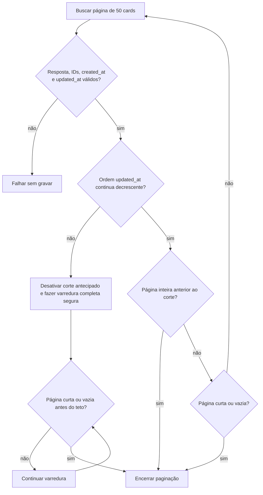
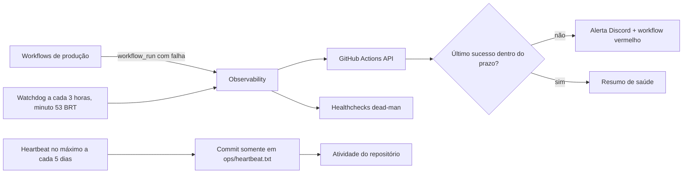

# iCaiu Data

[](https://github.com/operacoesicaiu/icaiu-data/actions/workflows/tests.yml)
[](https://github.com/operacoesicaiu/icaiu-data/actions/workflows/sheets-sync.yml)
[](https://github.com/operacoesicaiu/icaiu-data/actions/workflows/observability.yml)

Repositório central das automações de dados da **iCaiu**. Ele coleta dados de Hablla, SIGE, Zenvia e Zoho, atualiza bases no Google Sheets e mantém as tabelas `raw_` do Supabase.

> [!IMPORTANT]
> Este repositório pertence exclusivamente à iCaiu. Credenciais, planilhas, tabelas e dados da Loja do Sapo não são lidos, gravados nem compartilhados por estas automações.

## Visão geral



O workflow central de planilhas obtém **um token Google** e o compartilha com os sincronizadores executados naquela rodada. Se o token expirar, o cliente renova a autenticação quando recebe `401`; os provedores não iniciam nem encadeiam o autenticador Google por conta própria.

As duas saídas têm responsabilidades diferentes:

- **Google Sheets:** bases operacionais, atualizadas por substituição seletiva de janelas ou identificadores;
- **Supabase:** camada bruta e idempotente, atualizada por `upsert` em `external_id`.

Na camada `raw_`, o campo `payload` preserva o objeto devolvido pelo provedor. Relacionamentos, renomeações, enriquecimentos e outras transformações pertencem a uma camada derivada e não devem alterar o payload original.

## Organização

Os nomes dos arquivos usam o contexto das pastas; por isso `hablla/sheets/sync.js` não repete “hablla” no nome.

```text
icaiu-data/
├── .github/
│   ├── workflow-health.json       # prazos máximos esperados por automação
│   └── workflows/                 # agenda, testes, heartbeat e observabilidade
├── ops/
│   └── heartbeat.txt              # atividade automática do repositório
├── scripts/
│   └── health.js                  # watchdog e alertas
├── src/
│   ├── google/
│   │   ├── auth.js                # service account e renovação do token
│   │   └── sheets.js              # leitura, escrita e validação do Sheets
│   ├── sheets/
│   │   └── run.js                 # uma autenticação, vários sincronizadores
│   ├── hablla/
│   │   ├── api.js
│   │   ├── attendant-rows.js      # identidade composta e reconciliação
│   │   ├── card-collector.js
│   │   ├── date-range.js
│   │   ├── response-contracts.js
│   │   ├── sheets/sync.js
│   │   └── supabase/{cards,clients,attendants}.js
│   ├── sige/
│   │   ├── api.js
│   │   ├── sheets/sync.js
│   │   └── supabase/faturamento.js
│   ├── zenvia/
│   │   ├── response.js
│   │   ├── sheets/sync.js
│   │   └── supabase/calls.js
│   ├── zoho/
│   │   ├── api.js
│   │   ├── oauth.js
│   │   ├── response.js
│   │   ├── sheets/{leads,scheduling}.js
│   │   └── supabase/              # leads e agendamentos, completos e recentes
│   └── lib/                        # HTTP, datas BRT, paginação, erros e upsert
├── test/                           # contratos, resiliência e integridade
├── run-local.js
└── supabase/schema.sql
```

## Destinos e agendamentos

Os crons de dados sem `timezone` são interpretados em **UTC** pelo GitHub Actions. A coluna BRT usa `America/Sao_Paulo` (`UTC−03:00`). Horários quebrados reduzem a concentração de execuções nos minutos mais disputados; o GitHub ainda pode iniciar uma agenda alguns minutos depois do horário nominal.

| Provedor | Destino | Workflow | Cron UTC | Horário BRT |
|---|---|---|---:|---:|
| Hablla | Supabase `raw_events_hablla` | Hablla Cards | `13 3,9,15,21 * * *` | 00:13, 06:13, 12:13 e 18:13 |
| Hablla | Supabase `raw_contact_hablla` | Hablla Clients | `02 3,9,15,21 * * *` | 00:02, 06:02, 12:02 e 18:02 |
| Hablla | Supabase `raw_cs_avaliacao_atendimento` | Hablla Attendants | `07 7 * * *` | 04:07 |
| SIGE | Supabase `raw_events_faturado` | SIGE Faturamento | `38 4 * * *` | 01:38 |
| Zenvia | Supabase `raw_contact_telefonia` | Zenvia Calls | `23 4 * * *` | 01:23 |
| Hablla, SIGE, Zenvia e Zoho Leads | Sheets: `Base Hablla Card`, `Base Atendente`, `Base Cliente` quando existir, `Faturamento` e abas configuradas | Sheets Sync | `37 5,11,17,23 * * *` | 02:37, 08:37, 14:37 e 20:37 |
| Zoho | Supabase `raw_contact_site` | Zoho Leads Recent | `13 2,8,14,20 * * *` | 23:13¹, 05:13, 11:13 e 17:13 |
| Zoho | Supabase `raw_contact_site` | Zoho Leads | `27 16 * * *` | 13:27 |
| Zoho | Supabase `raw_events_agendamento` | Zoho Scheduling Recent | `18 1,7,13,19 * * *` | 22:18¹, 04:18, 10:18 e 16:18 |
| Zoho | Supabase `raw_events_agendamento` | Zoho Scheduling | `05 15 * * *` | 12:05 |
| Zoho | Google Sheets, aba configurada | Zoho Scheduling Sheets | manual | `workflow_dispatch` |

¹ O horário BRT pertence ao dia civil anterior à ocorrência UTC correspondente.

As rotinas “Recent” mantêm as mudanças frequentes com baixa latência; as rotinas diárias completas funcionam como reconciliação. Os respectivos `upsert`s usam a mesma chave externa, portanto uma nova coleta atualiza o registro em vez de criar outra cópia. No relatório de atendentes Hablla, a chave opaca combina dia, setor, usuário e conexão; após o `upsert`, IDs legados ou obsoletos da janela são removidos com segurança.

> [!WARNING]
> **Zoho Scheduling Sheets não é agendado.** Ele exige `ZOHO_SCHEDULING_SPREADSHEET_ID` e `ZOHO_SCHEDULING_SHEET_NAME`, além das demais credenciais Zoho/Google, e deve ser iniciado manualmente. Sua configuração não deve ser considerada validada até uma execução verde ser comparada com a planilha antes e depois.

## Atualização segura das planilhas

Uma sincronização não apaga a base inteira. Cada módulo identifica as linhas da janela atual — por data e/ou ID —, preserva as demais e grava a substituição em uma única operação do Google Sheets.



Proteções importantes:

- exclusões são agrupadas e executadas **de baixo para cima**, evitando deslocamento incorreto dos índices;
- o cabeçalho e a largura de todas as linhas são conferidos antes da escrita;
- uma mudança concorrente detectada entre as leituras aborta a operação;
- a pós-validação compara todas as colunas das linhas gravadas e, fora do alvo, confere quantidade, ordem e hash das colunas seletoras;
- escritas ambíguas não são repetidas cegamente: primeiro o estado final é lido e validado;
- Apps Script ou outro escritor legítimo pode alterar a planilha depois de uma execução bem-sucedida; por isso uma comparação posterior deve considerar o horário de cada gravação.

## Paginação eficiente do Hablla

Cards são solicitados com `order=updated_at`, `direction=desc` e corte temporal. A janela de negócio usa **`created_at`**, preservando o comportamento histórico. A data `updated_at` ordena a busca e permite provar quando as páginas seguintes já não podem conter um card criado dentro do prazo.



O worker histórico da iCaiu parava na primeira página sem criações recentes depois das duas páginas iniciais. O coletor atual não depende desse número heurístico: inclui somente `created_at` dentro da janela, deduplica por ID preservando a versão com `updated_at` mais recente e encerra cedo apenas enquanto confirma ordem decrescente. Também detecta página repetida e interrompe com erro se atingir `HABLLA_CARDS_MAX_PAGES`; o teto nunca é interpretado como coleta completa.

## Resiliência e idempotência

| Camada | Proteção | Comportamento diante de falha |
|---|---|---|
| HTTP compartilhado | timeout, `Retry-After`, backoff exponencial com jitter | repete somente falhas transitórias de rede, `408`, `429` e `5xx` |
| Hablla | autenticação compartilhada, espaçamento entre chamadas, contratos de resposta, ordem e teto de páginas | renova credencial quando possível; página inválida, repetida ou incompleta falha antes da persistência |
| SIGE | limite mínimo entre chamadas, formato explícito da resposta e teto diário | não interpreta resposta malformada como “zero registros” |
| Zenvia | atraso configurável, validação de resposta e progresso da paginação | interrompe em página repetida ou resposta incompatível |
| Zoho | OAuth central, no-data explícito, validação e teto de páginas | renova token e rejeita `200` sem o contrato esperado |
| Google Auth/Sheets | token compartilhado, renovação em `401`, leituras longas com retry | operações de leitura podem ser repetidas; inclusão não idempotente não é repetida cegamente |
| Supabase | lotes e `upsert` por `external_id` | repete lotes idempotentes somente em falhas transitórias |

Uma execução termina com erro quando não pode provar que a coleta ou a gravação ficou íntegra. Isso é intencional: um workflow vermelho é mais seguro do que publicar silenciosamente uma base parcial.

## Observabilidade e renovação das agendas



O sistema possui quatro sinais complementares:

1. **alerta imediato:** uma conclusão diferente de `success` dispara o workflow `Observability`;
2. **watchdog de atualidade:** a cada três horas, `scripts/health.js` consulta a API do GitHub e compara o último sucesso com `.github/workflow-health.json`;
3. **dead-man externo:** `HEALTHCHECKS_PING_URL` recebe início, sucesso ou falha; a ausência do ping também alerta quando o próprio GitHub Actions deixa de executar;
4. **heartbeat do repositório:** `Repository Heartbeat` usa o `GITHUB_TOKEN` efêmero e restrito ao próprio repositório para atualizar somente `ops/heartbeat.txt`, sem acessar dados de outra empresa.

| Workflow observado | Idade máxima sem sucesso |
|---|---:|
| Sheets Sync | 12 h |
| Hablla Cards / Clients | 10 h |
| Hablla Attendants | 36 h |
| SIGE Faturamento / Zenvia Calls | 36 h |
| Zoho Leads Recent / Scheduling Recent | 11 h |
| Zoho Leads / Scheduling | 36 h |
| Repository Heartbeat | 144 h |

O GitHub ainda pode enviar notificações por e-mail ou web. Para usar esse canal como redundância, habilite notificações de GitHub Actions — preferencialmente somente falhas — na conta responsável pelas agendas.

### Estados operacionais

| Estado | Significado | Ação |
|---|---|---|
| 🟢 Saudável | último sucesso está dentro do prazo | nenhuma intervenção |
| 🟡 Parcial | automações verdes, mas Discord ou Healthchecks não foi configurado | configurar o canal externo; o workflow registra o aviso |
| 🔴 Intervenção | falha, workflow desativado ou último sucesso vencido | seguir o runbook abaixo |

## Configuração

Copie `.env.example` para `.env` somente no ambiente local. O arquivo `.env` é ignorado pelo Git e **valores reais nunca devem ser adicionados ao README, ao código ou aos logs**.

### GitHub Secrets

Configure apenas no repositório `operacoesicaiu/icaiu-data`:

| Uso | Nomes dos secrets |
|---|---|
| Google | `GOOGLE_CLIENT_EMAIL`, `GOOGLE_PRIVATE_KEY` |
| Supabase | `SUPABASE_URL`, `SUPABASE_SERVICE_ROLE_KEY` |
| Hablla | `HABLLA_TOKEN`, `HABLLA_EMAIL`, `HABLLA_PASSWORD`, `HABLLA_WORKSPACE_ID`, `HABLLA_BOARD_ID`, `HABLLA_SPREADSHEET_ID` |
| SIGE | `SIGE_TOKEN`, `SIGE_USER`, `SIGE_APP`, `SIGE_SPREADSHEET_ID` |
| Zenvia | `ZENVIA_ACCESS_TOKEN`, `ZENVIA_QUEUE_ID`, `ZENVIA_SPREADSHEET_ID`, `ZENVIA_SHEET_NAME` |
| Zoho OAuth | `ZOHO_CLIENT_ID`, `ZOHO_CLIENT_SECRET`, `ZOHO_REFRESH_TOKEN`, `ZOHO_ACCOUNT_OWNER` |
| Zoho Leads | `ZOHO_LEADS_APP_NAME`, `ZOHO_LEADS_REPORT_NAME`, `ZOHO_LEADS_COLUMN_MAPPING`, `ZOHO_LEADS_SPREADSHEET_ID`, `ZOHO_LEADS_SHEET_NAME` |
| Zoho Scheduling | `ZOHO_SCHEDULING_APP_NAME`, `ZOHO_SCHEDULING_REPORT_NAME`, `ZOHO_SCHEDULING_COLUMN_MAPPING`, `ZOHO_SCHEDULING_SPREADSHEET_ID`, `ZOHO_SCHEDULING_SHEET_NAME` |
| Operação | `DISCORD_WEBHOOK_URL`, `HEALTHCHECKS_PING_URL` |

Discord e Healthchecks são opcionais para a execução dos coletores, mas necessários para alertas externos completos. O heartbeat recebe apenas `contents: write` no próprio job e não usa segredo persistente.

### GitHub Variables e ajustes de execução

Os workflows Hablla Cards leem as GitHub Variables `HABLLA_CARDS_DAYS` e `HABLLA_CARDS_MAX_PAGES`. Na ausência delas, o código aplica os padrões documentados em `.env.example`.

Outros controles reconhecidos localmente incluem:

```text
GOOGLE_SHEETS_READ_TIMEOUT_MS
GOOGLE_SHEETS_READ_MAX_ATTEMPTS
SUPABASE_BATCH_SIZE
SUPABASE_MAX_ATTEMPTS
HABLLA_CLIENTS_MAX_PAGES
HABLLA_ATTENDANTS_DAYS
HABLLA_MIN_INTERVAL_MS
HABLLA_REQUEST_TIMEOUT_MS
HABLLA_MAX_ATTEMPTS
SYNC_SCRIPT_MAX_ATTEMPTS
SIGE_MIN_INTERVAL_MS
SIGE_MAX_RECORDS_PER_DAY
ZENVIA_REQUEST_DELAY_MS
ZOHO_MAX_PAGES
```

Não aumente limites ou tentativas apenas para esconder uma falha recorrente; primeiro confirme contrato da API, paginação, cota e tempo de execução.

## Execução e testes

Instale exatamente as dependências travadas e execute a suíte:

```bash
npm ci
npm test
```

Exemplos de coletores Supabase locais:

```bash
node run-local.js hablla-cards
node run-local.js hablla-clients
node run-local.js hablla-attendants
node run-local.js zenvia-calls
node run-local.js sige-faturamento
node run-local.js zoho-leads
node run-local.js zoho-scheduling
```

Fluxo central de planilhas:

```bash
node src/sheets/run.js sige/sheets/sync.js zenvia/sheets/sync.js zoho/sheets/leads.js hablla/sheets/sync.js
```

Agendamento Zoho para Sheets, executado separadamente:

```bash
node src/sheets/run.js zoho/sheets/scheduling.js
```

> [!CAUTION]
> Os comandos de integração fazem chamadas e escritas reais. Antes de executá-los, use somente o `.env` da iCaiu, registre uma fotografia sem dados sensíveis — contagem, largura e hash — e compare novamente após a execução.

A suíte automatizada cobre contratos de resposta, paginação, retries, autenticação Google, integridade da substituição no Sheets, `upsert` e observabilidade. Ela reduz risco de regressão, mas não substitui uma execução real verde nem a comparação antes/depois das bases. Os badges no topo mostram o estado mais recente publicado no GitHub Actions.

## Segurança em repositório público

- nunca registre tokens, chaves, URLs secretas, payloads completos, nomes, telefones, e-mails ou IDs de clientes;
- logs operacionais devem mostrar somente etapa, contagem, duração e categoria pública da falha;
- respostas de provedores são validadas, mas não despejadas no console;
- `.env` permanece fora do Git; apenas `.env.example` com nomes e valores inofensivos é versionado;
- resultados `raw_` ficam no Supabase, não em artefatos públicos do Actions;
- credenciais de uma empresa não devem ser reaproveitadas para consultar dados de outra.

## Runbook de intervenção

1. Abra o link do alerta ou a aba **Actions** e leia o resumo da execução, sem copiar payloads para issues públicas.
2. Identifique a classe do problema:
   - `401`/`403`: credencial expirada, secret ausente ou permissão removida;
   - `408`/`429`/`5xx`: indisponibilidade ou limite do provedor; confirme se os retries esgotaram;
   - resposta ou página inválida: possível mudança no contrato da API;
   - validação do Sheets: concorrência, cabeçalho alterado ou resultado final diferente do esperado;
   - workflow vencido/desativado: execute manualmente `Repository Heartbeat` e depois o workflow afetado.
3. Corrija o secret, permissão, contrato ou destino. Nunca reduza uma validação de integridade para fazer a execução “ficar verde”.
4. Antes do rerun, fotografe a base por contagem, largura e hash; depois compare os mesmos indicadores e confira a janela afetada.
5. Execute manualmente apenas o workflow necessário e confirme `success` no próprio Actions.
6. Se a execução ficar verde mas o watchdog continuar vermelho, aguarde a próxima verificação ou execute `Observability` manualmente.

Para `Zoho Scheduling Sheets`, além do workflow verde, confirme explicitamente que `ZOHO_SCHEDULING_SPREADSHEET_ID` e `ZOHO_SCHEDULING_SHEET_NAME` apontam para a base correta da iCaiu.
