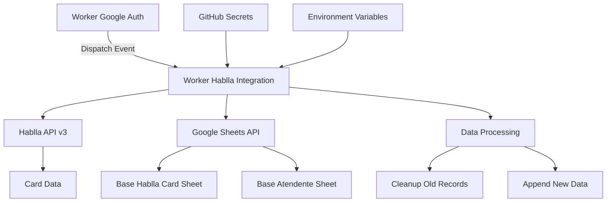
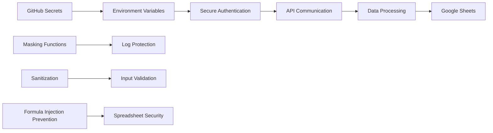
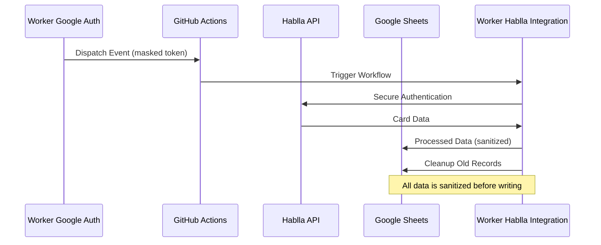

# Worker Hablla Integration

## Overview

This repository contains a Node.js automation worker designed to synchronize data between the Hablla API and Google Sheets. It handles card processing, attendant reports, and historical data cleanup within a structured CI/CD pipeline.

## Repository Integration

This worker operates in conjunction with the `worker-google-auth` repository.

* **Trigger Mechanism**: It is activated via a `repository_dispatch` event named `google_token_ready`.
* **Token Handover**: The authentication worker generates a Google Access Token and dispatches it directly to this repository's workflow payload.
* **Decoupling**: This architecture ensures that the integration worker does not need to manage long-lived Google Service Account keys, receiving only short-lived bearer tokens.

## Configuration

Configure the following secrets in your GitHub repository:

- `GOOGLE_TOKEN`: Google Sheets API access token (provided by worker-google-auth)
- `HABLLA_TOKEN`: **Workspace Token from Hablla** (recommended, doesn't expire)
- `HABLLA_WORKSPACE_ID`: Hablla workspace ID
- `HABLLA_BOARD_ID`: Hablla board ID
- `SPREADSHEET_ID`: Google Sheets spreadsheet ID
- `DB_COLABORADOR_ID`: Collaborator database spreadsheet ID

### Obtaining the Workspace Token

1. Execute a flow in Hablla Studio that uses an API component
2. In the response, the token will be available in the `Authorization` header
3. Use this value directly as `HABLLA_TOKEN`

The code automatically detects whether it's a User Token or Workspace Token and configures the headers appropriately.

## Local Testing

For local development and testing:

```bash
npm install
npm run local
```

Make sure to configure the `.env` file with your credentials before running locally.

## System Architecture



## Technical Architecture

### Folder Structure
* **.github/workflows/main.yml**: Defines the GitHub Actions automation logic and environment mapping.
* **index.js**: The core logic for API communication, data parsing, and spreadsheet manipulation.
* **package.json**: Manages project metadata and the `axios` dependency.

### Functional Stages

1. **Metadata Retrieval**: Identifies specific sheet IDs within the target spreadsheet.
2. **Collaborator Mapping**: Fetches a centralized database of employees to cross-reference IDs with names.
3. **Hablla Authentication**: Performs a secure login to the Hablla API using encrypted secrets.
4. **Optimized Cleanup**: Scans the Google Sheet from bottom to top to identify and remove records older than 7 days. It includes a stop condition after 20 consecutive old rows to prevent unnecessary API calls.
5. **Data Synchronization**: Fetches new cards from the Hablla API v3 and appends them to the "Base Hablla Card" sheet.
6. **Reporting**: Generates a daily summary of service metrics (TME, TMA, CSAT) for the "Base Atendente" sheet.

## Security Implementation

### Multi-Layer Security Architecture



### Security Features

* **Zero Hardcoded Secrets**: All sensitive credentials (passwords, IDs, and tokens) are injected via GitHub Secrets or encrypted payloads.
* **Token Scoping**: Uses short-lived Google OAuth2 tokens valid only for the duration of the execution.
* **Safe Logging**: The script confirms process milestones without printing raw JSON payloads or sensitive authorization headers to the console.
* **Explicit Secret Masking**: All secrets are explicitly masked in GitHub Actions workflows using `::add-mask::`.
* **Minimal Permissions**: Workflows use `contents: read` permissions only, reducing potential damage from compromised workflows.
* **Secure Logging**: Custom `secureLog` function ensures no sensitive data is exposed in logs.
* **Spreadsheet Formula Injection Prevention**: Custom `sanitize` function prevents malicious formulas from being injected into Google Sheets.

## Data Flow Security



## Optimization Features

* **Batch Processing**: Uses `batchUpdate` for row deletions and `append` for data insertion to minimize Google Sheets API quota consumption.
* **Pagination Control**: Implements smart pagination that breaks the loop if no new records are found after two consecutive pages.
* **Rate Limiting**: Includes a `sleep` utility to respect API rate limits during heavy data insertion.
* **Efficient Cleanup**: Implements a stop condition after 20 consecutive old rows to prevent unnecessary API calls.

## Setup

### Prerequisites

1. Worker Google Auth repository configured and running
2. Hablla API credentials with appropriate permissions
3. Google Sheets with proper access permissions

### Configuration

1. Ensure all required GitHub Secrets are configured:
   - `HABLLA_EMAIL`
   - `HABLLA_PASSWORD`
   - `HABLLA_WORKSPACE_ID`
   - `HABLLA_BOARD_ID`
   - `SPREADSHEET_ID`
   - `DB_COLABORADOR_ID`
2. Deploy the `worker-google-auth` to trigger this workflow automatically.

### Environment Variables

| Variable | Description | Required |
|----------|-------------|----------|
| `GOOGLE_TOKEN` | Google OAuth2 Access Token | Yes (via dispatch) |
| `HABLLA_EMAIL` | Hablla API email | Yes |
| `HABLLA_PASSWORD` | Hablla API password | Yes |
| `HABLLA_WORKSPACE_ID` | Hablla workspace identifier | Yes |
| `HABLLA_BOARD_ID` | Hablla board identifier | Yes |
| `SPREADSHEET_ID` | Google Sheets document ID | Yes |
| `DB_COLABORADOR_ID` | Collaborator database sheet ID | Yes |

## Monitoring & Observability

* **Execution Logs**: Secure logging with masked sensitive data
* **Status Tracking**: Integration with cloud-operations-monitor for uptime tracking
* **Error Reporting**: Structured error handling with secure error messages
* **Performance Metrics**: Built-in timing and pagination tracking

## License

This project is licensed under the MIT License - see the LICENSE file for details.

## Security Compliance

This implementation follows security best practices:

- ✅ **Zero Trust Architecture**: No hardcoded secrets or credentials
- ✅ **Defense in Depth**: Multiple layers of security controls
- ✅ **Principle of Least Privilege**: Minimal permissions and short-lived tokens
- ✅ **Secure by Design**: Security built into the architecture from the ground up
- ✅ **Public Repository Safe**: No sensitive data exposed even in public repositories
- ✅ **Input Validation**: All external data is validated and sanitized
- ✅ **Output Encoding**: Prevents injection attacks in Google Sheets

## Author

**Patrick Araujo - Security Researcher & Computer Engineer**  
**GitHub**: https://github.com/PkLavc
